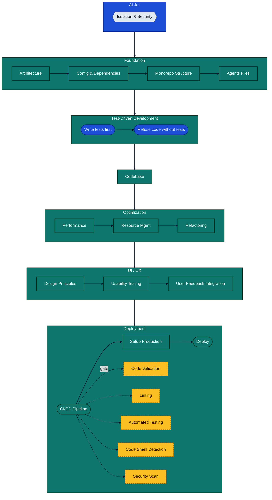

# Development Workflow

This document describes the phase-based development lifecycle used to build the AgentCloud Analytics Dashboard. The goal is to make AI-assisted development predictable: sandbox the AI, require tests first, optimize intentionally, and ship through verified gates.

## Workflow Overview

The workflow is a top-to-bottom lifecycle. Each phase has a clear checkpoint so new contributors know when to move forward:

1. **AI Jail** — lock down isolation/security before doing anything else.
2. **Foundation** — settle architecture, dependencies, monorepo structure, and agent config.
3. **TDD** — write failing tests first; refuse code changes until tests exist (AI moves faster when tests are the guardrails).
4. **Code** — implement only what the tests demand.
5. **Optimization** — profile, manage resources, and refactor.
6. **UI / UX** — design, test with users, and integrate feedback.
7. **Deployment** — run CI gates, prepare production, deploy with rollback; every commit should be production-ready (small releases).

## Visual Flow

## How to Use This Workflow

1. **Start in AI Jail**: run AI agents sandboxed; scrub secrets; review outbound writes.
2. **Lock the Foundation**: create/update an ADR [CLAUDE.md](../CLAUDE.md); pin and scan dependencies; settle monorepo layout; commit agent configs.
3. **Pair program with the agent**: keep prompts short, iterate; you provide direction and domain context, the agent provides scaffolding and options.
4. **Enforce TDD**: write failing tests first; do not accept code changes until tests exist. Let the agent draft tests; you validate intent.
5. **Build to the tests**: write only the code required to satisfy the current test set; keep changes small and reviewable. Commit-by-commit CI is expected (small releases).
6. **Optimize deliberately**: profile, enforce performance/resource budgets, refactor continuously instead of batching "big refactors."
7. **Validate UX**: run a design pass, do a quick moderated usability check, fold in user feedback.
8. **Ship safely**: ensure CI gates (lint, tests, smells, vuln scan) are green; confirm prod parity; deploy with a rollback plan.

## Guidelines

- Keep PRs scoped to one phase when possible.
- Prefer automation over policy: wire refusal rules into tooling (pre-commit, CI) instead of relying on memory.
- Document decisions: update ADRs and agent configs when behavior changes; maintain a living spec (e.g., `CLAUDE.md`) that the agent can ingest each session.
- Budget-first optimization: measure before refactoring; avoid premature optimization.

### What the AI Does Well

- Boilerplate/scaffolding, mechanical refactors, and generating edge-case tests.
- Fast lookup of standards/RFCs; consistent application of existing patterns.

### Where Humans Must Lead

- Architecture and prioritization (the agent tends to over-engineer).
- Security posture and non-obvious protections (rate limits, SSRF, encryption).
- Domain knowledge and trade-offs; saying "no" when the agent says "yes" to everything.

## Phase Checklists

- **AI Jail**: sandboxed execution; secrets redacted; outbound writes reviewed.
- **Foundation**: ADR exists; deps pinned and scanned; monorepo layout agreed; agent configs committed.
- **TDD**: failing tests first; refusal rule enforced until tests present.
- **Code**: implementation matches tests; small, reviewable changes.
- **Optimization**: hotspots profiled; budgets enforced; refactor before feature creep.
- **UI / UX**: design pass done; moderated usability check; feedback integrated.
- **Deployment**: CI gates green (lint, tests, smells, vulns); prod parity confirmed; rollback ready.

## Bibliography

- [Do Zero a Pos-Producao em 1 Semana](https://akitaonrails.com/2026/02/20/do-zero-a-pos-producao-em-1-semana-como-usar-ia-em-projetos-de-verdade-bastidores-do-the-m-akita-chronicles/)
- [How to Use CLAUDE.md in Claude Code in 5 Minutes](https://www.youtube.com/watch?v=h7QJL2_gEXA)
- [Writing a Good CLAUDE.md](https://www.humanlayer.dev/blog/writing-a-good-claude-md)
